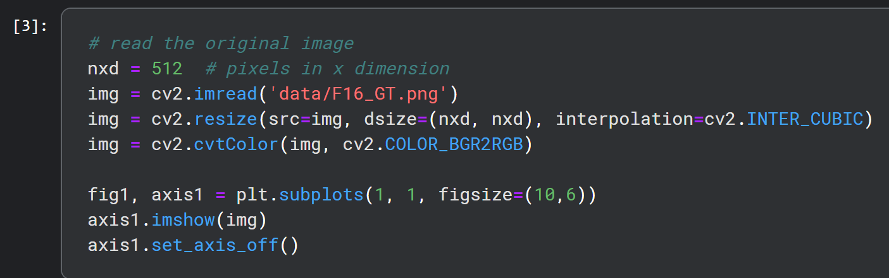

# GAI_Project4

## Overview
In this project, we are asked to introduce gradual denoising steps during the DIP training process, similar to the denoising steps in DDPM. By adding noise to the target image at different levels and using these noisy versions as intermediate targets, then guide the DIP model to learn a hierarchical representation of the image.

To implement this approach, we modify the DIP training algorithm to include multiple denoising stages. At each stage, the target image is corrupted with noise of varying levels, creating a sequence of noisy images. The DIP model is then trained to reconstruct these noisy images in a progressive manner, starting from the most heavily corrupted image and gradually moving towards the clean target image.

During training, we should monitor the reconstruction quality of the DIP model at each denoising stage. I use metrics peak signal-to-noise ratio (PSNR) to quantify the similarity between the reconstructed images and the corresponding noisy targets. By analyzing the improvement in reconstruction quality across the denoising stages, I  developed a criterion to early stop the DIP training.

I experimented with different noise levels (stages), and DIP architectures to find the most effective configuration. I also investigated the impact of this approach on the final reconstructed image quality and compare it with traditional early stopping methods used in DIP. All the results are shown in `reports.pdf`.

## Requirements
- Install all the dependencies in the requirements.txt
```
pip install -r requirements.txt
```

## Usage
### 1. Git clone or download the codes/notebooks manually.
```
git clone https://github.com/JasperLin0118/GAI_HW4.git
```
### 2. Running the notebook
- You can use any of the notebooks in the repository. The differences between the notebooks are listed in `report.pdf`.
- If you run the notebook on local, remember to replace the image path as shown below (relative path):
- <p align="center">
  
</p>

- Basically just run all the cells in order and you can see the results.
